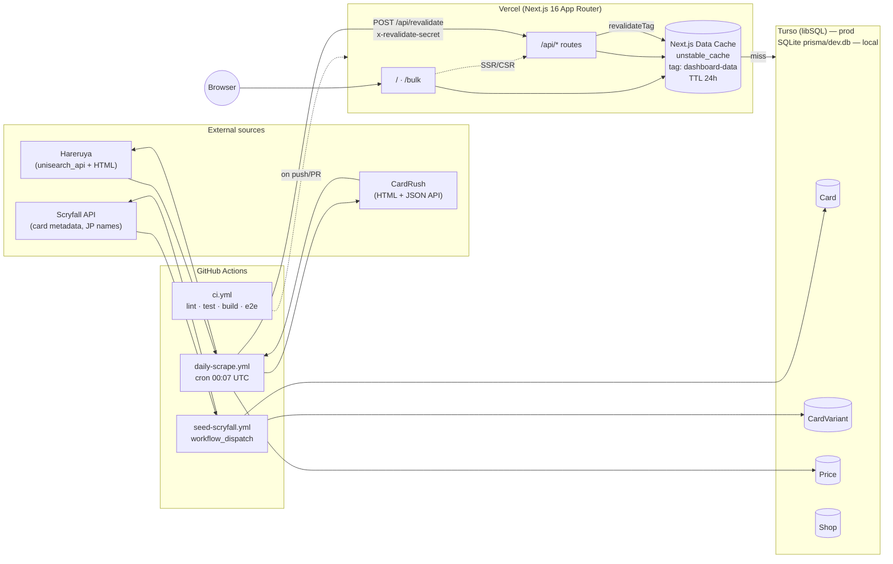
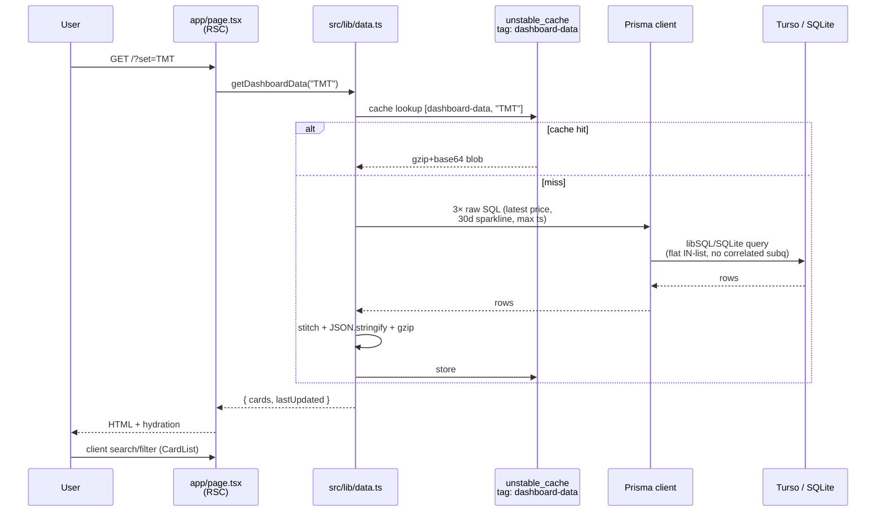
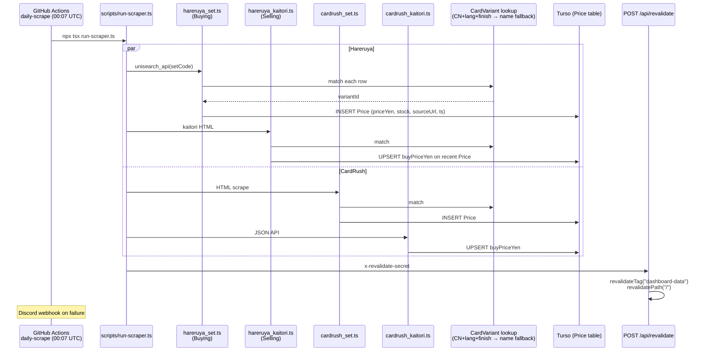
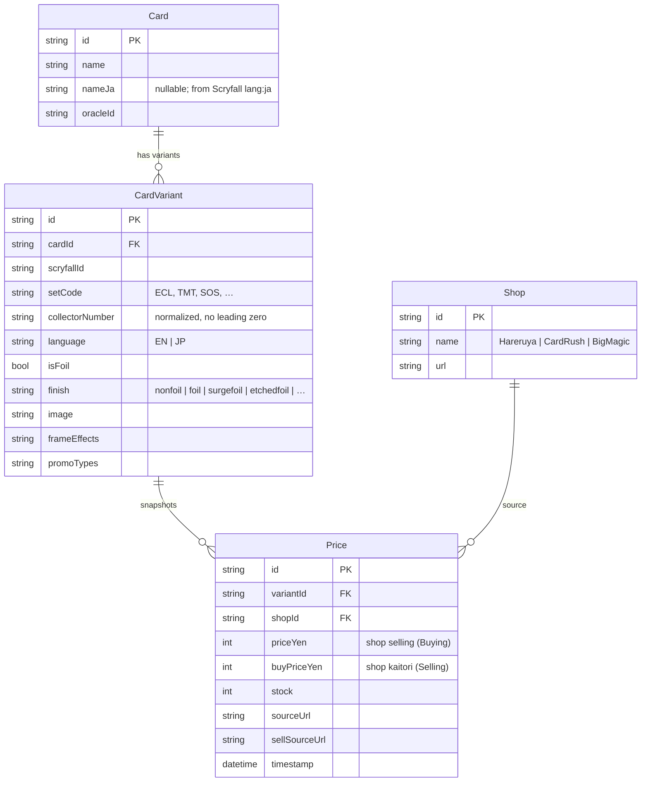
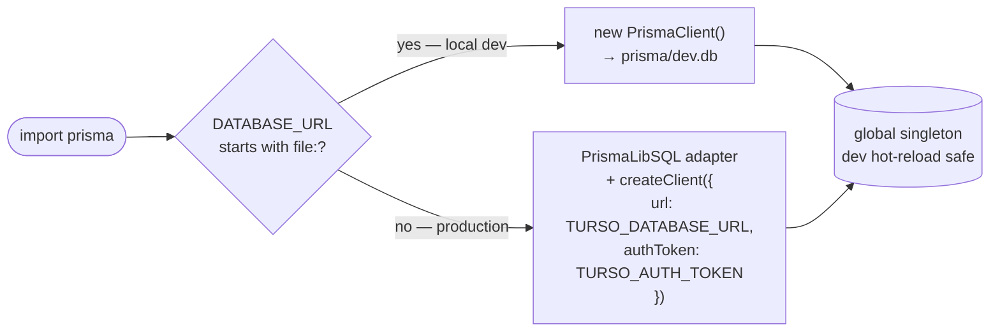
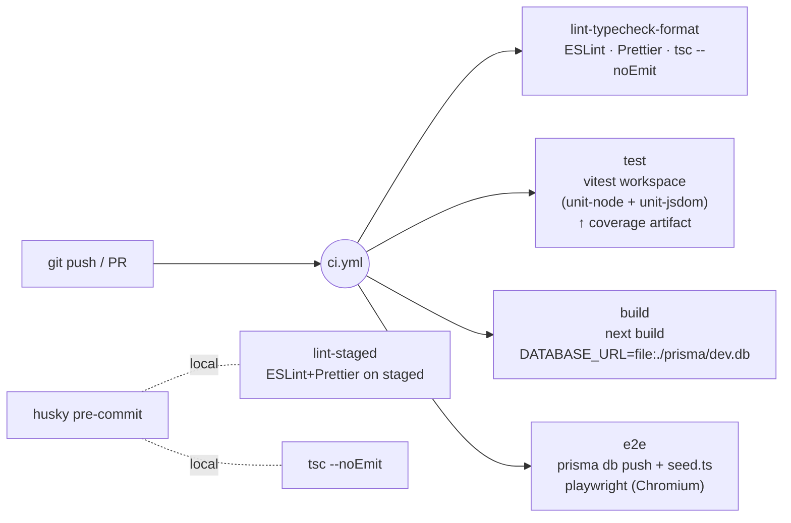

# Architecture

Technical diagrams of how PotatoPriceTracker is wired together. All diagrams are Mermaid and render on GitHub.

## 1. System topology

End-to-end view: data sources, runtime, storage, and automation.



## 2. Read path — dashboard

How a page render resolves card data.



## 3. Write path — daily scrape

How prices land in the database every day.



## 4. Data model

Three core entities plus Shop. `CardVariant` is keyed on `(setCode, collectorNumber, language, finish)`.



## 5. Bulk pricing flow

`/bulk` deck-list lookup — independent path from the dashboard.

```mermaid
flowchart TD
    Paste["Paste Arena text<br/>or Moxfield CSV"] --> Parser["src/lib/bulk-parser.ts<br/>parseDeckList / parseMoxfieldCsv"]
    Parser -->|ParsedLine[]| API["POST /api/bulk-price"]

    API --> Match{Token-locked?<br/>setCode + CN present}
    Match -->|yes| Lock["Lock to variant<br/>by CN+set, prefer lang/finish"]
    Match -->|no| Name["Match by name<br/>(EN + nameJa, case-insensitive)"]

    Lock --> Latest["Fetch latest Price per shop<br/>(single IN-list raw SQL)"]
    Name --> Latest

    Latest --> Sort["Sort by max(buyPriceYen) × qty DESC<br/>notFound last"]
    Sort --> Rows["ResolvedRow[]"]
    Rows --> UI["BulkPricer component<br/>variant chip + per-shop buy/sell"]
```

## 6. Dual-mode Prisma client

How `src/lib/prisma.ts` picks an adapter at runtime.



## 7. CI pipeline

Four parallel jobs on push/PR.


